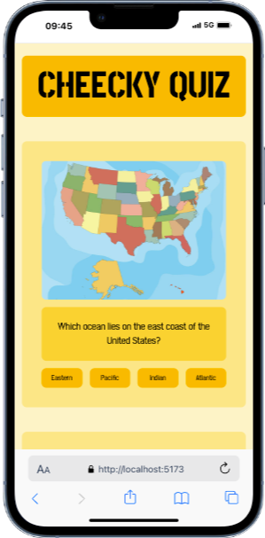

# Cheeky Quiz


Das Projekt „Cheeky Quiz“ wurde im Rahmen des sechsmonatigen Web-Development-Kurses während des „TypeScript“-Moduls entwickelt. Ziel dieses Projekts war es, meine neu erlernten Fähigkeiten in der Programmiersprache TypeScript zu demonstrieren. 
Das Quiz umfasst insgesamt 10 Fragen, die alle korrekt beantwortet werden müssen, um eine vollständige Auswertung zu erhalten. Die Auswertung variiert je nach Anzahl der richtig beantworteten Fragen sowohl im Inhalt als auch im Stil. Benutzer*innen haben zudem die Möglichkeit, durch einen Button mit der Aufschrift „Nochmal spielen“ an den Seitenanfang zurückzukehren und das Quiz erneut zu durchlaufen.

## Table of Contents 

- [Über das Projekt](#über-das-projekt)
- [Tech Stack](#tech-stack)
- [Getting Started](#getting-started)
  - [Voraussetzungen](#voraussetzungen)
  - [Installation](#installation)
- [Design](#design)
- [Deployment](#deployment)

## Über das Projekt

   

Für die Entwicklung dieses Projekts habe ich Visual Studio Code als Entwicklungsumgebung verwendet und die Website unter Einsatz von HTML sowie Tailwind CSS gestaltet. Die Funktionen zum Klicken der Antworten, zur Auswertung sowie zum Neustarten des Quiz habe ich in TypeScript implementiert.

Das Hauptziel dieses Projekts war es, die bis dahin erlernten Konzepte, insbesondere in TypeScript, praxisnah anzuwenden.

Der Nutzer bzw. die Nutzerin erhält durch die Färbung des Hintergrunds der jeweiligen Frage unmittelbar eine visuelle Rückmeldung, ob die Antwort korrekt oder falsch war. Um eine abschließende Auswertung zu erhalten, kann der Nutzer bzw. die Nutzerin den Button „Check your score“ betätigen. Hier wird der prozentuale Anteil der korrekt beantworteten Fragen angezeigt. Zusätzlich erscheint der Button „Play again“, der das Quiz zurücksetzt und den Nutzer bzw. die Nutzerin an den Seitenanfang führt.

## Tech Stack

**Markup:**  
  

**Styling:**  

  

**IDE:**  
  

**TS:**<br/>


**Version Control:**  
  


## Getting Startet

Hier ist eine Anleitung, wie du das "Cheeky Quiz"-Projekt auf deinem lokalen Rechner einrichtest und ausführst:

### Voraussetzungen

Folgende Programme solltest du installiert haben:

- [Git](https://git-scm.com/)
- [VS Code](https://code.visualstudio.com/download)
- [Vite](https://v5.vite.dev/guide/)
- [Tailwind CSS](https://tailwindcss.com/docs/installation/using-vite)

### Installation

1. **Clone das "Repository":**
   ```bash
   git clone https://github.com/YvonneJL/Cheeky-Quiz-Project
   ```

### Ausführen des Projekts

2. **Öffne das Projekt und installiere Vite und Tailwind CSS, indem du den Instruktionen auf den oben verlinkten Webseiten folgst :**
 
**Alles ist eingerichtet! Nun kannst du das "Cheeky Quiz"-Projekt erkunden und dein Wissen testen.

## Design

Für das Design des Projekts gab es keine spezifischen Vorgaben. Ich habe mich für eine schlichte Gestaltung entschieden, da der Fokus dieses Projekts auf der praktischen Anwendung von TypeScript liegt. Das Design ist responsiv und wurde insbesondere für die Nutzung auf Smartphones entwickelt.

## Deployment

Hier gelangst du direkt zur Webseite
- [Cheeky Quiz](cheeky-quiz-project-a6v22yoy9-yvijls-projects.vercel.app)
